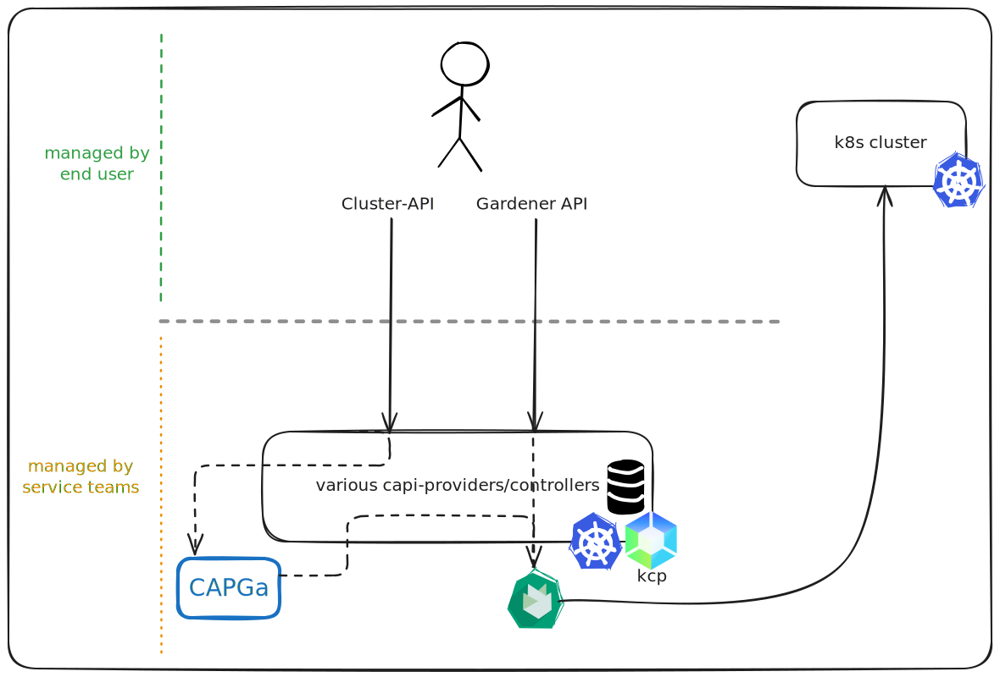

## Announcing cluster-api-provider-gardener: A New Way to Manage Clusters with Cluster API and Gardener

We’re pleased to share that we have published [cluster-api-provider-gardener (CAPGa)](https://github.com/gardener/cluster-api-provider-gardener/), an open-source [Cluster API](https://cluster-api.sigs.k8s.io/) provider that uses Gardener as the underlying platform for cluster lifecycle management.

<!-- truncate -->

### What is cluster-api-provider-gardener (CAPGa)?

CAPGa allows you to manage Kubernetes clusters through Cluster API means, with Gardener acting as the cloud-independent cluster orchestrator.

Specifically, CAPGa implements the Cluster API’s provider interfaces to manage Gardener’s [Shoot clusters](https://gardener.cloud/about/) as Cluster API `Cluster` resources. This enables users to provision, update, and delete clusters managed by Gardener via standard Cluster API tooling and workflows.

### Why did we build CAPGa?

Gardener provides a powerful way to manage Kubernetes clusters at scale across many infrastructures. At the same time, Cluster API has become a widely adopted standard for cluster management. CAPGa aims to bridge these two projects, giving users a way to manage Gardener clusters with Cluster API-compatible controllers and tools.

### Key Features

- **Cluster API compatibility**: Use familiar Cluster API resources to create and manage Kubernetes clusters.
- **Still enjoy Gardener benefits**: Leverage Gardener’s existing support for various infrastructures, automatic version updates, hibernation and much more.

### Demo

### KCP support

CAPGa comes with built-in [kcp](https://www.kcp.io/) support, allowing users to interact with a shared, multi-tenant control-plane that is purpose-built for Kubernetes-like APIs beyond traditional container workloads.

The long-term goal is to support CAPGa within a centrally managed _Platform Mesh_ built on top of kcp. This approach eliminates the need for users to provision and operate a dedicated Kubernetes cluster solely to host their Cluster API components. At the same time, users can interact directly with the Gardener API through the same unified control plane, enabling flexible and consistent cluster lifecycle management across both interfaces. This scenario is also illustrated in the image below.

### Contributing

We encourage anyone interested to try out CAPGa and share your experiences. If you encounter issues or have ideas for improvements, please open an issue or a pull request in the [GitHub repository](https://github.com/gardener/cluster-api-provider-gardener). Contributions are very welcome.
